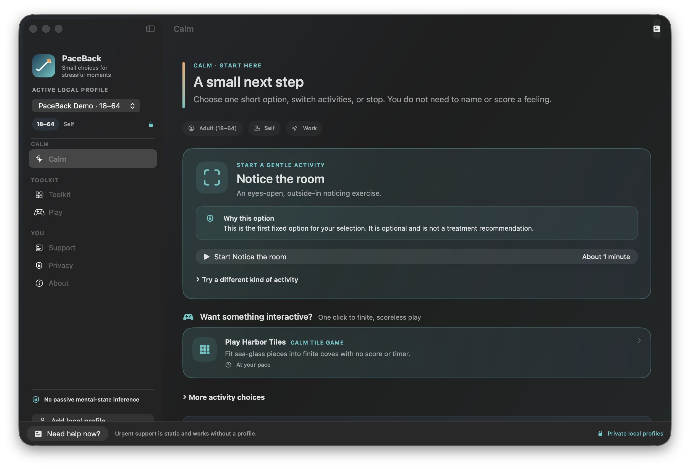
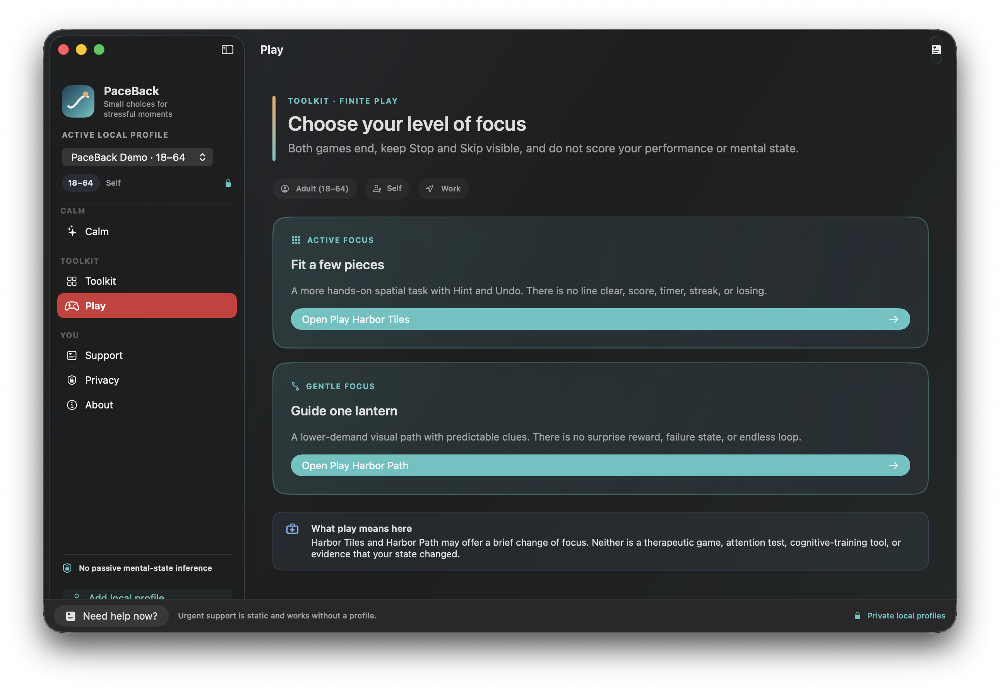
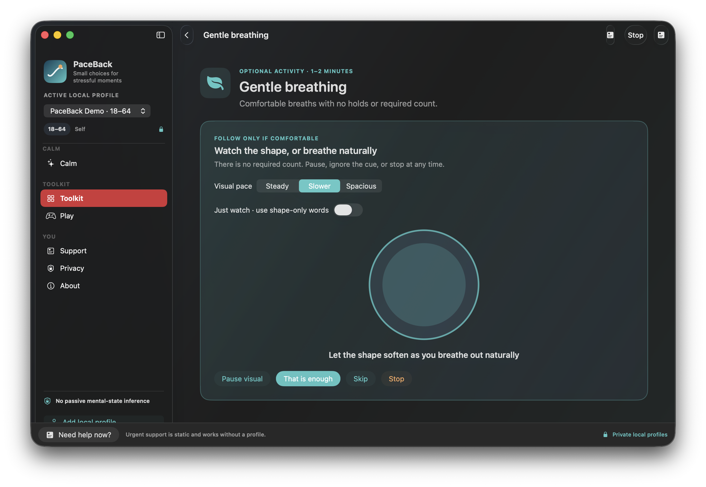

# PaceBack

PaceBack is a native macOS mental-wellbeing prototype for ordinary stressful moments when choosing what to do next feels difficult. It offers a no-save guest start, one immediate option, six plain-language needs, nine short activities, two finite games, and static routes to human support.

It does **not** diagnose a mental state, treat a disorder, promise calm, return anyone to a predefined “normal,” or replace professional or emergency care. Its exact activities, games, interface, and recommendation parameters have not been clinically validated.

## What the Mac app does

- **Calm:** one obvious starting option or an optional six-choice need picker.
- **Start without setup:** teen, adult, and older-adult users can enter a temporary guest session without an alias or Keychain write. The guest alias, choices, and check-outs disappear when it ends; app-wide display preferences remain on the Mac.
- **Toolkit:** orientation, comfortable breathing, muscle release, movement, trusted connection, screen-off pause, and one small step.
- **Play:** Harbor Tiles is now a multi-route spatial puzzle with hidden answers, optional hints, placement feedback, and more than one completion path per cove. Harbor Path offers gentler noticing. Both are scoreless, finite, session-only, and always stoppable.
- **Breathing pacer:** an adjustable expanding/softening visual can be paused, watched without breathing words, or used as a static manual cue when Reduce Motion is enabled.
- **Explicit adaptation:** an optional four-value check-out can reorder eligible activities. No free text, sensors, game behavior, dwell time, or support action is used.
- **Local privacy:** saved aliases, age/role boundaries, and check-outs are stored in AES-GCM encrypted profile generations with keys in macOS Keychain. An unreadable workspace fails closed instead of appearing empty, while a clearly labeled memory-only guest path keeps safe activities available without touching the locked data.
- **Support:** U.S.-labeled 988/911 actions, an international directory, and confirmed controls that open Messages or Contacts remain static and model-independent. PaceBack never chooses a person or sends anything.

The production target contains no Python helper, downloaded model, chatbot, account system, analytics SDK, ad SDK, or network service.

## Download the Mac app

The current universal release candidate supports Apple silicon and Intel Macs running macOS 14 or newer: [PaceBack releases](https://github.com/TanavG223/PaceBack/releases/latest).

This prototype is Apple Development-signed but not Developer ID notarized. After unzipping, Control-click **PaceBack.app**, choose **Open**, and confirm **Open**. If macOS still blocks it, use **System Settings → Privacy & Security → Open Anyway**. Verify the ZIP against the SHA-256 published with the release before opening it.

## Current Mac experience







## Build and verify without Xcode

PaceBack targets macOS 14 and newer and uses the standalone Apple Command Line Tools. Node.js is also required for the JavaScript syntax check inside `make verify`:

```sh
make macos-test
make macos-build
make package-macos
```

`make macos-test` runs the dependency-free `PaceBackVerification` executable. Its 58 checks cover the bounded catalogs, age gates, deterministic recommendation/cooldown behavior, finite and branching game state machines, support non-mutation, encrypted repository round trips, real ciphertext-tamper failure, deletion, legacy-schema decoding, the fail-closed workspace path, and the memory-only guest fallback. The historical XCTest files are not part of the current package because the standalone Command Line Tools installation on this machine does not include XCTest.

The packaged universal application (Apple silicon and Intel) is written to `build/PaceBack.app`. Packaging automatically uses an installed Apple Development identity so existing Keychain access survives rebuilds, with ad-hoc signing only as a fallback. Developer ID distribution signing and notarization are separate release gates.

## Read before making claims

- [Mental-wellbeing evidence contract](docs/mental_wellbeing_evidence_contract.md)
- [Competitive and open-source app comparison](docs/competitive_ux_research.md)
- [Game evidence boundary](docs/mental_wellbeing_game_research.md)
- [Safety and privacy](docs/safety_privacy.md)
- [Clinical and scientific limitations](docs/clinical_limitations.md)
- [Verification provenance](docs/provenance.md)
- [Release acceptance walkthrough](docs/release_acceptance_2026-09-03.md)
- [v0.3.0 release candidate and checksum](docs/release_v0.3.0.md)

The defensible product claim is: **PaceBack makes a small set of optional, evidence-informed activities easy to choose, stop, switch, or leave for human support.** Whether PaceBack itself reduces stress or improves wellbeing remains untested.
